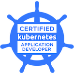

# Kubernetes Certification Study Repository

Personal repository for Kubernetes certification learning path: CKAD ✅, CKA 🎯, CKS 📚

[](https://www.credly.com/badges/1b0ff0eb-c36f-4a2d-8e43-2a7ec637eb39/public_url)

## 01_installation_configuration

Automated scripts for Kubernetes control plane setup and teardown on Ubuntu/Debian.

### Scripts

**[`install_cp.sh`](01_installation_configuration/install_cp.sh)** - Install Kubernetes control plane with containerd and Cilium CNI
```bash
chmod +x install_cp.sh
./install_cp.sh
```

**[`uninstall_cp.sh`](01_installation_configuration/uninstall_cp.sh)** - Complete removal of Kubernetes and all components
```bash
chmod +x uninstall_cp.sh
./uninstall_cp.sh
```

**[`install_worker.sh`](01_installation_configuration/install_worker.sh)** - Install Kubernetes worker node
```bash
chmod +x install_worker.sh

# Method 1: Command line argument
./install_worker.sh <CONTROL_PLANE_IP>

# Method 2: Environment variable
CONTROL_PLANE_IP=<CONTROL_PLANE_IP> ./install_worker.sh

# Method 3: Interactive (will prompt for IP)
./install_worker.sh
```

### ⚠️ Warning
These scripts completely wipe Kubernetes clusters. Use only on test systems.

### Features
- Dynamic version detection
- System requirements validation (2 CPU, 2GB RAM)
- Automatic cleanup of previous installations
- Multi-shell kubectl completion

### Why These Scripts?
`kubeadm reset` doesn't clean everything:
- CNI configuration remains in `/etc/cni/net.d`
- Port 6443 stays occupied
- Container images persist
- `$HOME/.kube` remains

The uninstall script handles complete cleanup including Cilium removal.